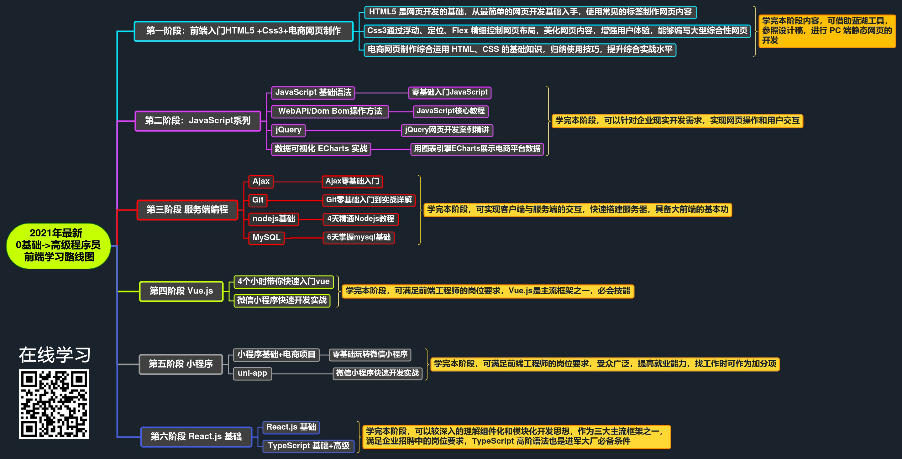

# 黑马程序员2021前端资料

打勾是整理出来的资料，未打勾是待整理的资料

- [x] React
- [ ] HTML5
- [ ] CSS3
- [ ] JavaScript
- [ ] jQuery
- [ ] Ajax
- [ ] Git
- [ ] node.js
- [ ] MySQL
- [ ] Vue.js
- [ ] 微信小程序
- [ ] TypeScript

### 黑马程序员2021年前端学习线路图

### 以下是对应的B站2021年黑马程序员前端视频。

|                         b站资源名称                          | B站在线观看地址                                              | 配套所在网盘位置 |
| :----------------------------------------------------------: | ------------------------------------------------------------ | ---------------- |
| 黑马程序员Pink老师Web前端入门教程，html5+css3+移动web实战项目\_零基础前端视频教程 | [https://www.bilibili.com/video/BV1pE411q7FU](https://www.bilibili.com/video/BV1pE411q7FU) | 第1阶段          |
| 黑马程序员JavaScript全套教程\_零基础入门JavaScript，Web前端必学的JS教程 | [https://www.bilibili.com/video/BV1ux411d75J](https://www.bilibili.com/video/BV1ux411d75J) | 第2阶段          |
| 黑马程序员前端基础教程-JavaScript核心教程，JS必会的DOM BOM操作\_pink老师 | [https://www.bilibili.com/video/BV1k4411w7sV](https://www.bilibili.com/video/BV1k4411w7sV) | 第2阶段          |
|       黑马程序员前端基础必备教程jQuery网页开发案例精讲       | [https://www.bilibili.com/video/BV1a4411w7Gx](https://www.bilibili.com/video/BV1a4411w7Gx) | 第2阶段          |
| 用最流行的图表引擎ECharts来展示电商平台数据，是不是超级酷炫  | [https://www.bilibili.com/video/BV1VZ4y1M7ZC](https://www.bilibili.com/video/BV1VZ4y1M7ZC) | 第2阶段          |
|          黑马程序员前端基础教程Ajax零基础入门\_上部          | [https://www.bilibili.com/video/BV1ox411M7P2](https://www.bilibili.com/video/BV1ox411M7P2) | 第3阶段          |
|          黑马程序员前端基础教程Ajax零基础入门\_下部          | [https://www.bilibili.com/video/BV15x411E7xH](https://www.bilibili.com/video/BV15x411E7xH) | 第3阶段          |
|                   Git零基础入门到实战详解                    | [https://www.bilibili.com/video/BV1sJ411D7xN](https://www.bilibili.com/video/BV1sJ411D7xN) | 第3阶段          |
|                 黑马程序员4天精通Nodejs教程                  | [https://www.bilibili.com/video/BV19t411Q768](https://www.bilibili.com/video/BV19t411Q768 "https://www.bilibili.com/video/BV19t411Q768") | 第3阶段          |
|                     6天掌握mysql基础视频                     | [https://www.bilibili.com/video/BV1Pt411E7Vn](https://www.bilibili.com/video/BV1Pt411E7Vn) | 第3阶段          |
|        黑马程序员前端基础教程-4个小时带你快速入门vue         | [https://www.bilibili.com/video/BV12J411m7MG](https://www.bilibili.com/video/BV12J411m7MG) | 第4阶段          |
|         黑马程序员Web前端教程\_零基础玩转微信小程序          | [https://www.bilibili.com/video/BV1nE41117BQ](https://www.bilibili.com/video/BV1nE41117BQ) | 第5阶段          |
| 前端开发利器vue，微信小程序快速开发实战，黑马程序员前端web教程 | [https://www.bilibili.com/video/BV1Sc41187nZ](https://www.bilibili.com/video/BV1Sc41187nZ) | 第5阶段          |
| 黑马程序员Pink老师精品WEB前端课程\_28节课快速玩转微信小程序  | [https://www.bilibili.com/video/BV1Ct411p7bj](https://www.bilibili.com/video/BV1Ct411p7bj) | 第5阶段          |
|  黑马程序员前端React精品教程， React从零基础入门到原理详解   | [https://www.bilibili.com/video/BV1gh411U7JD](https://www.bilibili.com/video/BV1gh411U7JD) | 第6阶段          |
|       2020年前端热门教程推荐五天从零基础学会TypeScript       | [https://www.bilibili.com/video/BV14Z4y1u7pi](https://www.bilibili.com/video/BV14Z4y1u7pi) | 第6阶段          |
| 黑马程序员pink老师前端教程，HTML5+CSS3京东项目实战\_前端必备基础 | [https://www.bilibili.com/video/BV1Vx411g7DP](https://www.bilibili.com/video/BV1Vx411g7DP) | 更多精品         |
|           前端教程\_18集搞定企业实战项目之PC专题页           | [https://www.bilibili.com/video/BV1tx411j7xk](https://www.bilibili.com/video/BV1tx411j7xk) | 更多精品         |
|                前端教程\_百度外卖项目实战开发                | [https://www.bilibili.com/video/BV1nx411E7Rh](https://www.bilibili.com/video/BV1nx411E7Rh) | 更多精品         |
|           Web前端移动开发进阶教程-乐淘移动商城项目           | [https://www.bilibili.com/video/BV1nW411Z7kT](https://www.bilibili.com/video/BV1nW411Z7kT) | 更多精品         |
|        最全面的Html5+css3教程，前端开发工程师进阶教程        | [https://www.bilibili.com/video/BV1b4411i742](https://www.bilibili.com/video/BV1b4411i742 "https://www.bilibili.com/video/BV1b4411i742") | 更多精品         |
|         黑马程序员web前端基础教程\_4天从零玩转jQuery         | [https://www.bilibili.com/video/BV1pt411H7D6](https://www.bilibili.com/video/BV1pt411H7D6) | 更多精品         |
